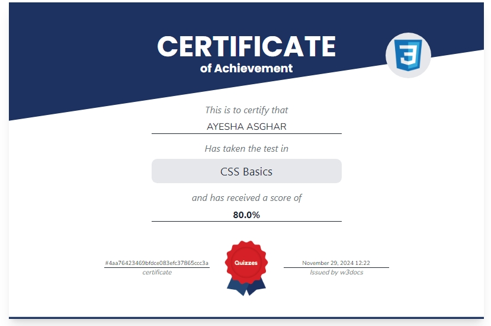
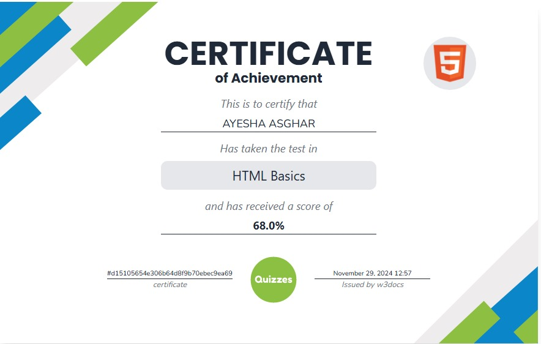
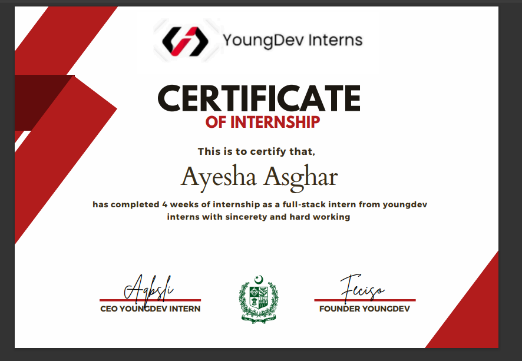
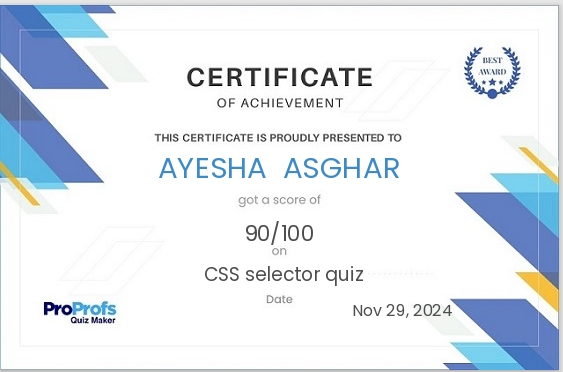

# Hi there! 👋 I'm Ayesha Asghar  

I am a passionate **Frontend Developer** currently training at **SMIT**. I love building web applications, solving complex problems, and learning new technologies. 🚀

---
### Skills:

### Tools

- **Git**
- **GitHub**
- **GitHub Desktop**
- **Visual Studio Code**
- **Canva**

## Contact Me
- **Email:** [ayeshh7766@gmail.com](mailto:ayeshh7766@gmail.com)

## 📜 Certificates
### 🏆 Certificate of Achievement - CSS Basics

### 🏆 Certificate of Achievement - HTML Basics

### 🏆 Internship Certificate - YoungDev Interns

### 🏆 Certificate of Achievement - CSS Selector Quiz

### 🏆 Certificate of Achievement - Html5 Quiz

### 🏆 Certificate of Achievement - CSS3 Quiz

### 🏆 Certificate of Completion - Information Technology (Creative-IT)  
  
---

🏆 Courses I Teach
br

📄 [Download HTML Notes](https://github.com/ayeshhdeveloper55/ayeshhdeveloper55/raw/main/html%20notes.pdf)
📄 [Download CSS Notes](https://github.com/ayeshhdeveloper55/ayeshhdeveloper55/raw/main/css%20notes%20my.pdf)
📄 [Tailwind CSS Cheat Sheet](https://github.com/ayeshhdeveloper55/ayeshhdeveloper55/blob/main/Tailwind%20CSS%20Cheat%20Sheet.pdf)

📌 *These certificates showcase my skills and learning progress in web development and IT!* 🚀

## 🌟 Projects
1. **Portfolio **  
🔗 **[Visit My Portfolio](https://ayeshhdeveloper55.github.io/My--personal-portfolio/)**

2.## 📄 Resume📄 **
🔗 **[Download My Resume](https://raw.githubusercontent.com/ayeshhdeveloper55/ayeshhdeveloper55/49157e7750bca773c78f824ee1b1859f16c54cf7/cvpic.PNG)**

⭐️ _“Always learning, always growing!”_
